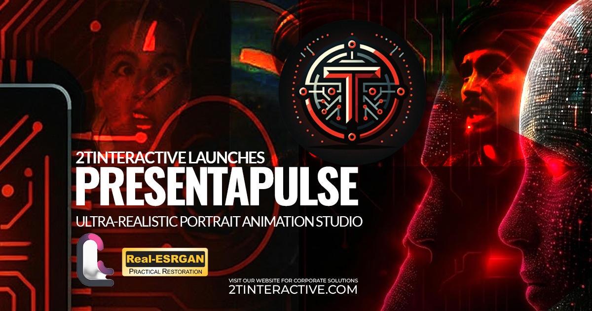

<div align="center">



# 🎬 PresentaPulse

### Ultra-Realistic Portrait Animation Studio

**Transform still images into lifelike animated portraits using LivePortrait and Real-ESRGAN**

[](https://www.python.org/)
[](LICENSE)
[]()
[](https://gradio.app/)

[Features](#-features) • [Installation](#-installation) • [Quick Start](#-quick-start) • [Models](#-pretrained-models) • [Requirements](#-system-requirements) • [API](#-api-integration) • [Documentation](#-documentation)

---

</div>

## 📋 Table of Contents

- [Overview](#-overview)
- [Features](#-features)
- [Installation](#-installation)
- [Quick Start](#-quick-start)
- [Pretrained Models](#-pretrained-models)
- [System Requirements](#-system-requirements)
- [Usage Guide](#-usage-guide)
- [API Integration](#-api-integration)
- [Performance](#-performance-optimization)
- [Troubleshooting](#-troubleshooting)
- [Contributing](#-contributing)
- [License](#-license)

---

## 🎯 Overview

**PresentaPulse** is a powerful, feature-rich application for creating ultra-realistic animated portraits from still images. Built on top of LivePortrait and enhanced with Real-ESRGAN, it provides a comprehensive suite of tools for professional-quality portrait animation.

### Key Highlights

- ✨ **Advanced AI Models** - Powered by LivePortrait and Real-ESRGAN
- 🎨 **Modern UI/UX** - Beautiful dark theme with glassmorphism design
- ⚡ **High Performance** - GPU acceleration, batch processing, and optimization
- 🔧 **Extensive Controls** - Fine-tune every aspect of your animations
- 📦 **Multiple Export Formats** - MP4, MOV, WebM, GIF, and frame sequences
- 🔌 **REST API** - Programmatic access for integration

---

## ✨ Features

### 🎥 Core Animation Features

| Feature                  | Description                                       |
|--------------------------|---------------------------------------------------|
| **Portrait Animation**   | Transform still images into animated portraits    |
| **Multi-Face Detection** | Detect and process multiple faces in group photos |
| **Face Selection**       | Choose which faces to animate                     |
| **Eye/Lip Retargeting**  | Fine-tune facial expressions                      |
| **Relative Motion**      | Natural motion transfer from driving videos       |

### 🎨 Enhancement Features

| Feature                     | Description                              |
|-----------------------------|------------------------------------------|
| **Real-ESRGAN Integration** | Multiple model support (4 models)        |
| **Quality Presets**         | Low, Medium, High, Ultra quality options |
| **Temporal Smoothing**      | Reduce jitter between frames             |
| **Denoising**               | Remove noise from videos                 |
| **Motion Stabilization**    | Reduce camera shake                      |

### 📐 Format & Export Features

| Feature                     | Description                              |
|-----------------------------|------------------------------------------|
| **Aspect Ratios**           | 1:1, 16:9, 9:16, 4:3, 21:9, Custom       |
| **Smart Cropping**          | Center, face-aware, directional cropping |
| **Background Preservation** | Padding mode maintains full image        |
| **Export Formats**          | MP4, MOV, WebM, GIF, Frame sequences     |
| **Custom Resolution**       | Export at any resolution                 |

### ⚡ Performance Features

| Feature                   | Description                    |
|---------------------------|--------------------------------|
| **GPU Memory Management** | Automatic memory optimization  |
| **Batch Processing**      | Process multiple images/videos |
| **Processing Queue**      | Thread-safe queue system       |
| **Multi-GPU Support**     | Automatic GPU selection        |
| **Low-Memory Mode**       | Optimized for weaker GPUs      |
| **Checkpoint/Resume**     | Resume interrupted processing  |

### 🎯 Advanced Controls

| Feature                  | Description                           |
|--------------------------|---------------------------------------|
| **Expression Intensity** | Amplify or reduce expression strength |
| **Blink Frequency**      | Control blink rate                    |
| **Head Movement**        | Adjust head movement intensity        |
| **Gaze Direction**       | Control eye gaze direction            |
| **Expression Presets**   | 6 predefined expression presets       |

### 🔊 Audio Features

| Feature                 | Description                               |
|-------------------------|-------------------------------------------|
| **Audio Sync**          | Extract and sync audio from driving video |
| **Background Music**    | Add background music with volume control  |
| **Audio Normalization** | Consistent audio levels                   |
| **Loop Audio**          | Loop audio if shorter than video          |

### 🎨 UI/UX Features

| Feature                | Description                          |
|------------------------|--------------------------------------|
| **Real-time Preview**  | Preview frames during processing     |
| **History & Gallery**  | View and manage previous generations |
| **Comparison View**    | Before/after side-by-side comparison |
| **Keyboard Shortcuts** | Quick actions with keyboard          |
| **Progress Tracking**  | Real-time progress with ETA          |

---

## 🚀 Installation

### Prerequisites

- **Python** 3.8 or higher
- **pip** (Python package manager)
- **FFmpeg** (for video processing)
- **CUDA-capable GPU** (recommended, CPU mode available)

### Step 1: Clone Repository

```bash
git clone https://github.com/LebToki/PresentaPulse.git
cd PresentaPulse
```

### Step 2: Create Virtual Environment

**Windows:**
```batch
python -m venv venv
venv\Scripts\activate
```

**Linux/Mac:**
```bash
python -m venv venv
source venv/bin/activate
```

### Step 3: Install Dependencies

**Windows (Recommended):**
```batch
install.bat
```

**Manual:**
```bash
pip install -r requirements.txt
```

### Step 4: Verify Setup

```batch
check_setup.bat
```

---

## ⚡ Quick Start

### Windows

```batch
# Run application
run.bat
```

### Manual

```bash
python app.py
```

### Access Web Interface

Open your browser and navigate to:
```
http://localhost:8080
```

---

## 📦 Pretrained Models

### Required Models (~2.5 GB total)

Download all models to `pretrained_weights/` directory.

#### LivePortrait Models (~1.3 GB)

```bash
# Clone LivePortrait models (requires git-lfs)
git lfs install
git clone https://huggingface.co/KwaiVGI/liveportrait pretrained_weights
```

**Model Files:**
- `liveportrait/landmark.onnx` (~50 MB)
- `liveportrait/base_models/appearance_feature_extractor.pth` (~200 MB)
- `liveportrait/base_models/motion_extractor.pth` (~150 MB)
- `liveportrait/base_models/spade_generator.pth` (~400 MB)
- `liveportrait/base_models/warping_module.pth` (~300 MB)
- `liveportrait/retargeting_models/stitching_retargeting_module.pth` (~200 MB)

#### InsightFace Models (~500 MB)

Included in LivePortrait repository:
- `insightface/models/buffalo_l/2d106det.onnx` (~200 MB)
- `insightface/models/buffalo_l/det_10g.onnx` (~300 MB)

#### Real-ESRGAN Models (~165 MB)

| Model                            | Size   | Use Case                     | Download                                                                                                     |
|----------------------------------|--------|------------------------------|--------------------------------------------------------------------------------------------------------------|
| `RealESRGAN_x4plus.pth`          | ~67 MB | General purpose 4x upscaling | [Download](https://github.com/xinntao/Real-ESRGAN/releases/download/v0.1.0/RealESRGAN_x4plus.pth)            |
| `RealESRGAN_x4plus_anime_6B.pth` | ~17 MB | Anime/illustration optimized | [Download](https://github.com/xinntao/Real-ESRGAN/releases/download/v0.2.2.4/RealESRGAN_x4plus_anime_6B.pth) |
| `realesr-animevideov3.pth`       | ~17 MB | Anime video optimized        | [Download](https://github.com/xinntao/Real-ESRGAN/releases/download/v0.2.5.0/realesr-animevideov3.pth)       |
| `RealESRNet_x4plus.pth`          | ~64 MB | Network-based 4x upscaling   | [Download](https://github.com/xinntao/Real-ESRGAN/releases/download/v0.1.1/RealESRNet_x4plus.pth)            |

### Complete Directory Structure

```
pretrained_weights/
├── RealESRGAN_x4plus.pth                    (~67 MB)
├── RealESRGAN_x4plus_anime_6B.pth           (~17 MB)
├── realesr-animevideov3.pth                 (~17 MB)
├── RealESRNet_x4plus.pth                    (~64 MB)
│
├── insightface/
│   └── models/
│       └── buffalo_l/
│           ├── 2d106det.onnx                (~200 MB)
│           └── det_10g.onnx                 (~300 MB)
│
└── liveportrait/
    ├── landmark.onnx                        (~50 MB)
    ├── base_models/
    │   ├── appearance_feature_extractor.pth  (~200 MB)
    │   ├── motion_extractor.pth              (~150 MB)
    │   ├── spade_generator.pth              (~400 MB)
    │   └── warping_module.pth               (~300 MB)
    └── retargeting_models/
        └── stitching_retargeting_module.pth  (~200 MB)

Total: ~2.5 GB
```

---

## 💻 System Requirements

### Minimum Requirements

| Component   | Specification                            |
|-------------|------------------------------------------|
| **OS**      | Windows 10/11, Linux (Ubuntu 20.04+)     |
| **CPU**     | Intel i5 / AMD Ryzen 5 (4+ cores)        |
| **RAM**     | 8 GB                                     |
| **GPU**     | NVIDIA GTX 1060 (6GB VRAM) or equivalent |
| **Storage** | 10 GB free space (models + outputs)      |
| **Python**  | 3.8+                                     |

### Recommended Requirements

| Component   | Specification                         |
|-------------|---------------------------------------|
| **OS**      | Windows 11 / Linux (Ubuntu 22.04+)    |
| **CPU**     | Intel i7 / AMD Ryzen 7 (8+ cores)     |
| **RAM**     | 16 GB+                                |
| **GPU**     | NVIDIA RTX 3060 (12GB VRAM) or better |
| **Storage** | 20 GB+ SSD (faster processing)        |
| **Python**  | 3.10+                                 |

### Optimal Performance (RTX Series)

| Component   | Specification                         |
|-------------|---------------------------------------|
| **GPU**     | NVIDIA RTX 3070/3080/3090 (8GB+ VRAM) |
| **RAM**     | 32 GB                                 |
| **Storage** | NVMe SSD                              |
| **CUDA**    | 11.8+                                 |
| **cuDNN**   | 8.6+                                  |

### Power Consumption Estimates

| GPU Model       | Idle | Processing | Peak |
|-----------------|------|------------|------|
| GTX 1060 (6GB)  | 20W  | 120W       | 150W |
| RTX 3060 (12GB) | 30W  | 170W       | 200W |
| RTX 3070 (8GB)  | 25W  | 220W       | 250W |
| RTX 3080 (10GB) | 30W  | 320W       | 350W |
| RTX 3090 (24GB) | 50W  | 350W       | 450W |

**Processing Times:**
- **GTX 1060**: ~2-5 minutes per animation
- **RTX 3060**: ~30-60 seconds per animation
- **RTX 3070+**: ~15-30 seconds per animation

---

## 📖 Usage Guide

### Basic Animation

1. **Upload Image** - Select or upload a portrait image
2. **Upload Video** - Choose a driving video with facial expressions
3. **Configure Settings** (optional):
   - Enable/disable relative motion
   - Set crop and paste-back options
   - Adjust smoothing and denoising
4. **Click "Generate Animation"**
5. **Download Result** - Get your animated portrait!

### Multi-Face Processing

1. Upload image with multiple faces
2. Click **"Detect Faces"** button
3. Preview shows detected faces with bounding boxes
4. Select which faces to animate (or leave empty for all)
5. Generate animation - each face processed individually

### Aspect Ratio Customization

1. Open **"Animation Settings"** accordion
2. Select aspect ratio (16:9, 9:16, custom, etc.)
3. Choose crop mode (center, face-aware, etc.)
4. Enable "Preserve Background" for padding mode
5. Generate with your preferred format

### Batch Processing

1. Go to **"Batch Processing"** tab
2. Upload multiple images and videos
3. Configure batch settings
4. Click **"Start Batch Processing"**
5. Download individual files or ZIP archive

### Keyboard Shortcuts

- `Ctrl + Enter` - Generate Animation
- `Ctrl + R` - Refresh History Gallery
- `Ctrl + K` - Toggle Shortcuts Panel
- `Esc` - Close Modals/Accordions

---

## 🔌 API Integration

### REST API Server

PresentaPulse includes a REST API server for programmatic access.

#### Start API Server

```bash
python api_server.py
```

The API server runs on `http://localhost:5000` by default.

### API Endpoints

#### Health Check

```http
GET /api/health
```

**Response:**
```json
{
  "status": "healthy",
  "timestamp": "2024-01-01T00:00:00",
  "version": "1.0.0"
}
```

#### Generate Animation

```http
POST /api/v1/generate
Headers:
  X-API-Key: your_api_key
Content-Type: application/json

{
  "image_path": "path/to/image.jpg",
  "video_path": "path/to/video.mp4",
  "parameters": {
    "relative_motion": true,
    "do_crop": true,
    "remap": true
  }
}
```

**Response:**
```json
{
  "job_id": "abc123",
  "status": "queued",
  "estimated_time": 60
}
```

#### Get Job Status

```http
GET /api/v1/job/{job_id}
Headers:
  X-API-Key: your_api_key
```

#### Create API Key

```http
POST /api/v1/keys
Content-Type: application/json

{
  "name": "My Application",
  "rate_limit": 100
}
```

#### Register Webhook

```http
POST /api/v1/webhook
Headers:
  X-API-Key: your_api_key
Content-Type: application/json

{
  "url": "https://example.com/webhook",
  "events": ["job.completed", "job.failed"]
}
```

### Rate Limiting

- Default: 1000 requests per hour per IP
- Per-endpoint limits can be configured
- API key-based rate limiting available

### Authentication

API keys are required for most endpoints. Include the API key in headers:

```
X-API-Key: your_api_key
```

Or as a query parameter:

```
?api_key=your_api_key
```

---

## ⚡ Performance Optimization

### GPU Memory Management

- Automatic cache clearing
- Memory usage monitoring
- Low-memory mode for weaker GPUs

### Enable Low-Memory Mode

Set environment variable:
```bash
export LOW_MEMORY_MODE=true
```

Or toggle in UI: **Performance & System Info** → **Low Memory Mode**

### Batch Processing Tips

- Process multiple items in queue
- Automatic resource management
- Progress tracking per item

### Multi-GPU Support

- Automatic GPU detection
- Load balancing
- Device selection in UI

---

## 🛠️ Troubleshooting

### Common Issues

#### Import Errors

**Problem:** `Import "src.utils.helper" could not be resolved`

**Solution:** Clone LivePortrait repository and copy `src/` directory:
```bash
git clone https://github.com/KwaiVGI/LivePortrait.git
cp -r LivePortrait/src PresentaPulse/src
```

#### CUDA Out of Memory

**Solution:** Enable low-memory mode or reduce batch size

#### FFmpeg Not Found

**Solution:** Install FFmpeg and ensure it's in PATH:
- Windows: Download from [ffmpeg.org](https://ffmpeg.org/download.html)
- Linux: `sudo apt-get install ffmpeg`
- Mac: `brew install ffmpeg`

#### Models Not Found

**Solution:** Download models to `pretrained_weights/` directory (see [Pretrained Models](#-pretrained-models))

### Getting Help

- Check [SETUP.md](SETUP.md) for detailed setup instructions
- Review [ENHANCEMENTS.md](ENHANCEMENTS.md) for feature documentation
- Open an issue on GitHub for bugs or feature requests

---

## 📚 Documentation

### Additional Documentation Files

- **[SETUP.md](SETUP.md)** - Detailed setup instructions
- **[ENHANCEMENTS.md](ENHANCEMENTS.md)** - Complete feature roadmap
- **[CHANGELOG.md](CHANGELOG.md)** - Version history
- **[ENHANCEMENTS_SUMMARY.md](ENHANCEMENTS_SUMMARY.md)** - Quick feature reference
- **[FEATURES_COMPLETE.md](FEATURES_COMPLETE.md)** - Completed features list

---

## 🤝 Contributing

Contributions are welcome! Please feel free to submit a Pull Request.

### Contribution Guidelines

1. Fork the repository
2. Create your feature branch (`git checkout -b feature/AmazingFeature`)
3. Commit your changes (`git commit -m 'Add some AmazingFeature'`)
4. Push to the branch (`git push origin feature/AmazingFeature`)
5. Open a Pull Request

### Code Style

- Follow PEP 8 Python style guide
- Add docstrings to functions and classes
- Include type hints where possible
- Write clear commit messages

---

## 🙏 Acknowledgements

Special thanks to the creators of:

- **[LivePortrait](https://github.com/KwaiVGI/LivePortrait)** - Core animation technology
- **[Real-ESRGAN](https://github.com/xinntao/Real-ESRGAN)** - Video enhancement
- **[InsightFace](https://github.com/deepinsight/insightface)** - Face detection
- **[Gradio](https://gradio.app/)** - Web interface framework

---

## 📄 License

This project is licensed under the MIT License - see the [LICENSE](LICENSE) file for details.

---

## 👤 Author

**Tarek Tarabichi**  
[2TInteractive](https://2tinteractive.com)

---

## 🌟 Show Your Support

If you find this project useful, please consider:

- ⭐ **Starring** the repository
- 🐛 **Reporting** bugs
- 💡 **Suggesting** new features
- 📢 **Sharing** with others

---

<div align="center">

**Made with ❤️ by [2TInteractive](https://2tinteractive.com)**

[Website](https://2tinteractive.com) • [GitHub](https://github.com/LebToki) • [Issues](https://github.com/LebToki/PresentaPulse/issues)

---

*Last Updated: November 20th, 2025*

</div>
